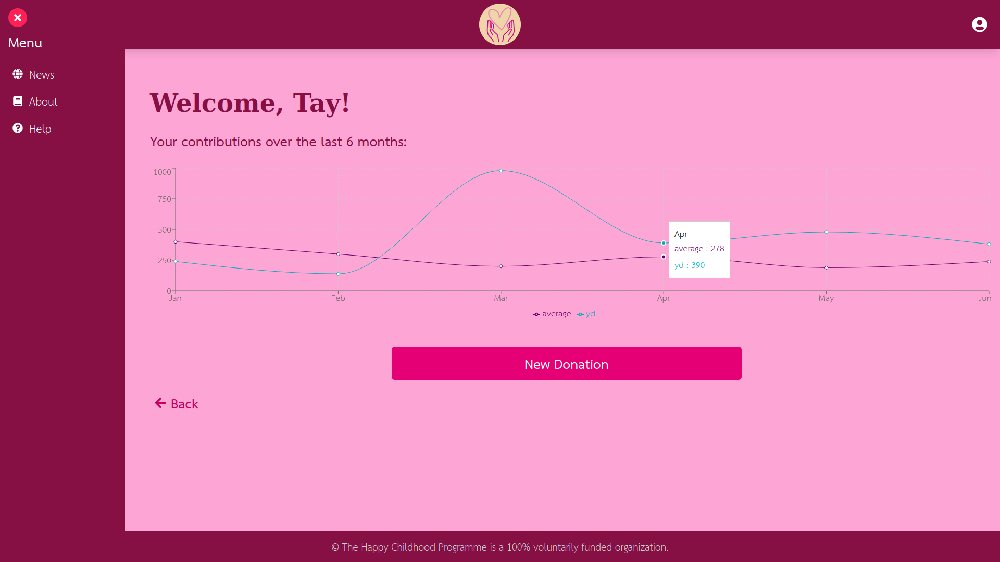
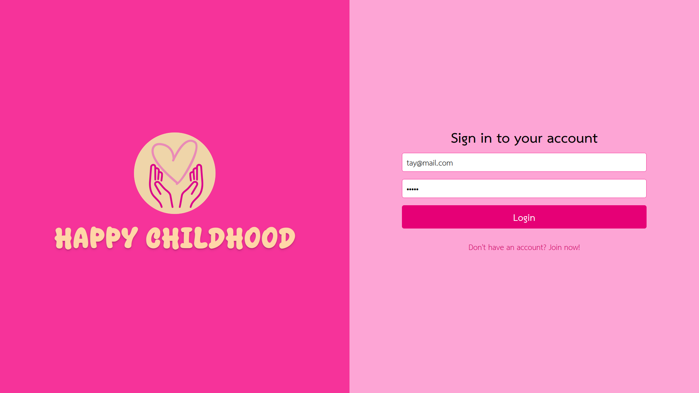

<p align="center">
    
</p>
<h1 align="center">Happy Childhood</h1>
<p align="center"> This is an implementation of a system that seeks to facilitate donations for needy children, so that people from other regions can make donations.</p>
<p align="center">
    
</p>

## 💡 Objective

<p>The goal of the project was to practice backend and frontend technologies and their integration.</p>
<p>In the backend, the concepts of routing and database connection were practiced.</br>
In the frontend, knowledge of styling and the use of components was improved.</p>

## 🚀 Technologies

<table>
  <tr>
    <td valign="top" width="30%">
      <h3>Backend:</h3>
      <ul>
        <li></li>
        <li></li>
        <li></li>
        <li></li>
      </ul>
      <h3>Frontend:</h3>
      <ul>
        <li></li>
        <li></li>
      </ul>
       <h3>Full Stack:</h3>
      <ul>
        <li></li>
      </ul>
    </td>
    <td valign="top" width="50%">
      
    </td>
  </tr>
</table>

## ⚙️ Running

- Clone the project:
  ```sh
  git clone https://github.com/kenandjak/Donation_System.git
  ```

### 🐋 Running with Docker

1. Create a .env file in the root directory and fill it with your credentials (use .env.example as a template):

   ```sh
   DATABASE_URL=your_mongodb_atlas_url

   JWT_SECRET=your_secret_key
   ```

2. Build and start the containers:
   ```sh
   docker compose up --build
   ```
3. Once the containers are up, the system will be available at:
<ul>
<li>Frontend: http://localhost:5173</li>
<li>Backend: http://localhost:3001</li>
</ul>

### 🛠️ Manual Development (without Docker)

1. Backend:
   ```sh
   cd backend
   ```
   ```sh
   npm install
   ```
   ```sh
   npx prisma generate
   ```
   ```sh
   node --watch server.js
   ```
2. Frontend:
   ```sh
   cd frontend
   ```
   ```sh
   npm install
   ```
   ```sh
   npm run dev
   ```

## ⚖️ License

This project is under the MIT license.
